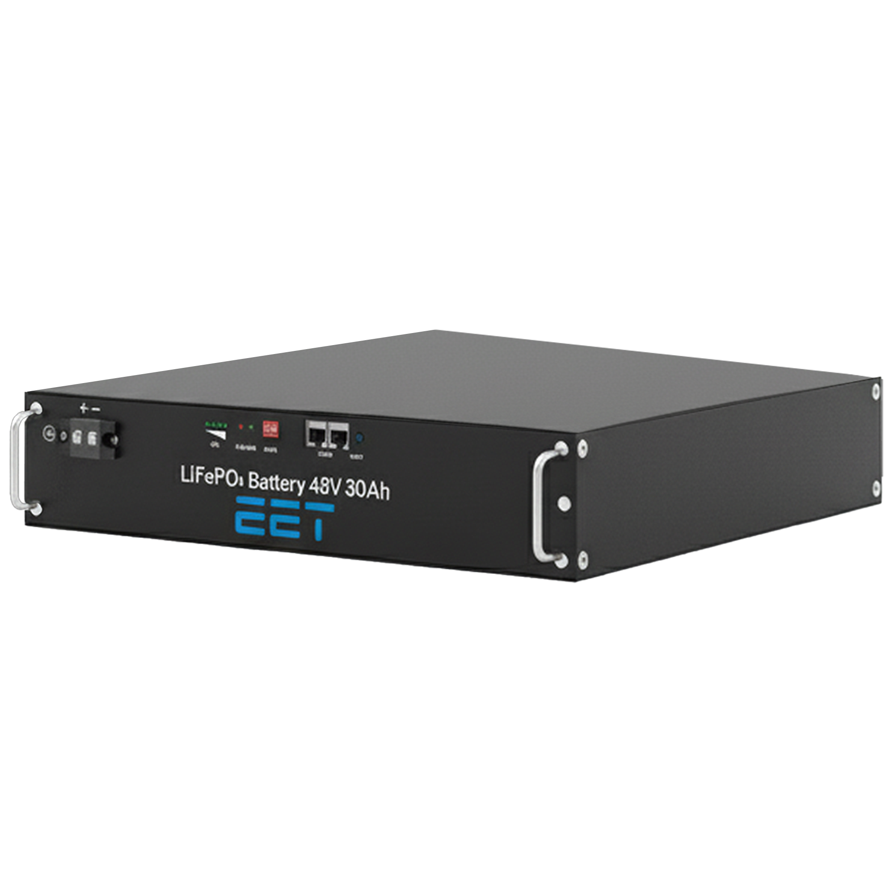

# 5 BATTERY
The battery is the main storage component in the SolMate system and has a rated capacity of 25Ah or 30Ah. Main supplier will be Topband Batteries. 

## 5.1 ELECTRICAL CHARACTERISTICS 
For detailed information about the electrical characteristics and communication capabilities, please refer to the datasheet of the individual battery. 
**Battery 25 Ah:** TB4825F-T110D-3201-ESS Specification V00.pdf - Nextcloud (eet.energy) 
**Battery 50 Ah:** TB4850F-T110AE-3201-ESS Specification V00.pdf - Nextcloud (eet.energy) 

## 5.2 COMMUNICATION 
For the physical layer RS485 is used. On top of this Layer Modbus RTU is implemented which is a protocol which has been standardized for industrial applications. Communication speed is 9600 kbit/s, the PCM acts as the master and is responsible for starting transmissions. The following parameters can be written/read using this communication. 

| Parameter        | Unit | Description                           |
| ---------------- | ---- | ------------------------------------- |
| Status           |      | Indication the status                 |
| Error            |      | Indicates errors                      |
| Voltage          | V    | Stack Voltage                         |
| Current          | A    | Battery Current                       |
| Charge           | mAh  | Current state of charge               |
| NMOS Temperature | °C   | Temperature of the ON/OFF Transistors |

## 5.3 FEATURE DESCRIPTION 
### 5.3.1 Waking up / entering sleep mode
The battery can be put into deep sleep by pressing the reset button for 3 seconds. In deep sleep, the charge and discharge MOSFETs will be disabled and the BMS enters a low power state which reduces the self-consumption from 0.48Ah/day to 14.4 mAh/month. The battery can be turned on again by again pressing the reset button for 3 seconds or by charging the battery.
Please Note: Always shut down the battery when working on the system! Connecting the power connectors while the battery is running can result in sparks which can permanently damage the connector or degrade its performance. 

### 5.3.2 Heating System
These batteries include a heating system which protects the cells from low temperatures. The system is implemented by heating pads which are directly glued to the cells itself and will be controlled by the BMS. They get activated when the temperature of the cells drop below -3°C and will get turned off when the temperature reaches +10°C. The heating system will only be active when the battery is being charged.