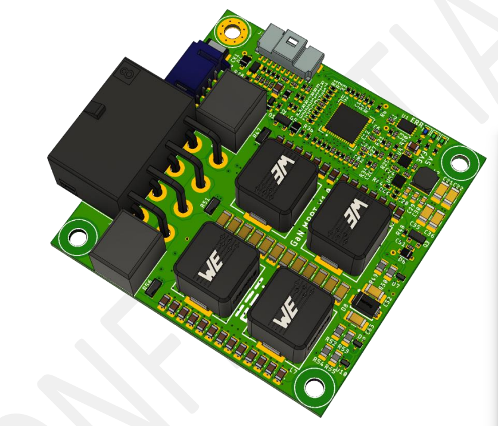
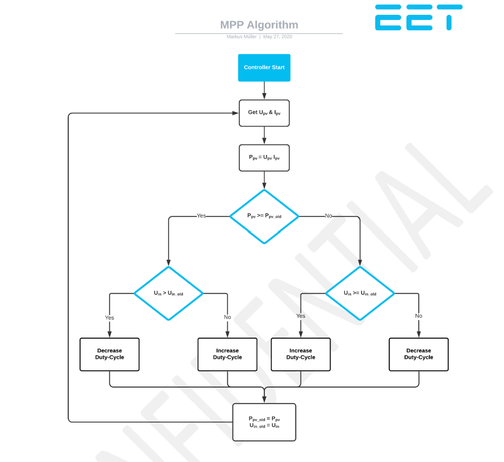
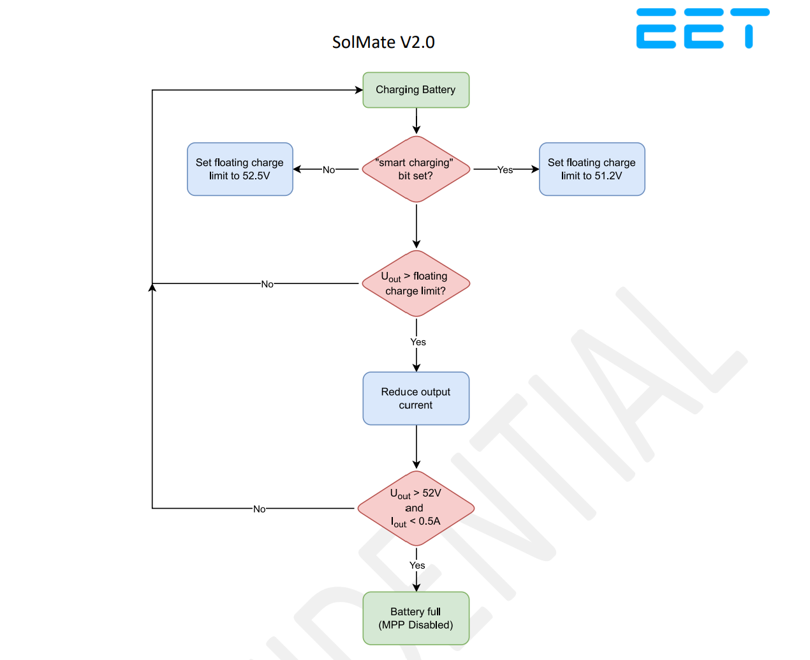

# MAXIMUM POWER POINT TRACKER

The MPPT in the SolMate system is used for power conversion. It boosts the DC input voltage of the PV panels to the higher DC voltage required to charge the battery. The GaN MPPT has two independent PV inputs. Each input uses two interleaved synchronous boost phases, for a total of four phases. Gallium Nitride High Electron Mobility Transistors (GaN HEMTs) are used for the switching stages to increase power density while maintaining high efficiency.

The firmware controls both PV inputs independently, but exposes one shared communication interface and one shared output voltage/current limit for the complete converter.

## 2.1 ELECTRICAL CHARACTERISTICS

| Parameter                 | Symbol                 | Min | Typ | Max       | Unit |
| :------------------------ | :--------------------- | :-- | :-- | :-------- | :--- |
| Input Voltage             | Vin         | 6   | 32  | 65 1 | V |
| Output Voltage            | Vout        |     | 48  | 60        | V |
| Input Current (per Input) | Iin         | 0   |     | 20        | A |
| Input Current (total)     | Iin,total   | 0   |     | 40 2 | A |
| Output Current            | Iout        | 0   |     | 28 3 | A |
| Operating Temperature     | Top         | -20 |     | 100       | deg C |
| Efficiency                | eta                    |     |     | 98        | % |
| Switching Frequency       | fsw         |     | 500 |           | kHz |
| Fan Voltage               | VFAN        |     | 5   |           | V |
| RS485 Baud Rate           |                        |     | 9600 |          | bit/s |

1 Maximum voltage which can be handled by hardware. During operation the PV input voltage must not exceed the battery/output voltage. 
2 May be reduced by firmware current limiting or thermal derating. 
3 Hardware capability. The firmware default output current limit is 15 A.

## 2.2 COMMUNICATION

The physical layer is RS485. The application layer is Modbus RTU. The default slave address of the MPPT is `0x05`; the firmware also uses `0x15` as its master-side address when it initiates a transaction. UART configuration is 9600 bit/s, 8 data bits, 1 stop bit. CRC16 is used according to Modbus RTU.

Supported function codes:

| Function Code | Function                 |
| ------------- | ------------------------ |
| `0x03`        | Read holding registers   |
| `0x10`        | Write multiple registers |

The firmware exposes the `MPPCom` structure directly over Modbus. The low byte of the Modbus start address is interpreted as a byte offset into this structure. Multi-byte values are transferred in the MCU memory order. Values are unsigned unless explicitly marked as signed.

### 2.2.1 Register Map

| Byte Offset | Size | Access | Parameter             | Unit / Scaling | Description |
| ----------- | ---- | ------ | --------------------- | -------------- | ----------- |
| 0           | 2    | R/W    | Status flags          | bit field      | MPPT command and state flags |
| 2           | 2    | R/W    | Error flags           | bit field      | Latched and active error flags |
| 4           | 8    | R      | Temperature 1..4      | signed 0.1 deg C | Temperature of the four power stages |
| 12          | 2    | R      | Output voltage        | mV             | Battery/output voltage |
| 14          | 4    | R      | Input voltage 1..2    | mV             | PV input voltages |
| 18          | 4    | R      | Input current 1..2    | mA             | PV input currents |
| 22          | 2    | R      | Output current        | mA             | Battery/output current |
| 24          | 4    | R      | Dynamic input current limit | mA       | Firmware currently reports the calculated total input current limit here; accumulated energy counting is disabled in the current firmware |
| 28          | 2    | R      | Fan speed             | rpm            | Fan tachometer speed |
| 30          | 2    | R      | Hardware version      | raw            | ADC-derived hardware revision |
| 32          | 2    | R/W    | Output current limit  | mA             | Default is 15000 mA |
| 34          | 2    | R/W    | Input 1 voltage setpoint | mV          | Used when MPP tracking is disabled |
| 36          | 2    | R/W    | Input 2 voltage setpoint | mV          | Used when MPP tracking is disabled |
| 38          | 2    | R/W    | Manual fan command    | signed %       | `-1` enables automatic fan control; `0..100` sets fan PWM manually |

Firmware write protection only accepts write accesses to the status/error area and to the writable command fields from byte offset 32 onward, with a maximum write length of two Modbus registers per request. The defined writable command fields end at byte offset 39. Other write requests are rejected with Modbus exception code `0x02`.

### 2.2.2 Status Bit Description

| Bit | Name                    | Description |
| --- | ----------------------- | ----------- |
| 0   | Enabled                 | Enables converter operation when set. Clearing this bit disables both PV inputs. |
| 1   | Tracking                | Enables MPP tracking when set. When cleared, `vin1_set` and `vin2_set` are used as fixed input voltage targets. |
| 2   | Floating Charge         | Set by firmware after leaving battery-full state and entering the floating-charge hysteresis region. |
| 3   | Battery Full            | Charging is stopped because the output voltage is at the charging limit and output current is below 0.5 A. |
| 4   | Smart Charging          | Set by the PCM to reduce charging thresholds near high battery SOC. |
| 5   | Low Battery Derating    | Reserved in the current firmware. The low-battery derating code is present but disabled. |
| 6   | Low Temperature Derating | Reserved for battery low-temperature derating. Not implemented in the current MPPT firmware. |

### 2.2.3 Error Bit Description

| Bit | Name                  | Description |
| --- | --------------------- | ----------- |
| 0   | Communication         | Reserved for communication errors. |
| 1   | Temperature Limit     | Maximum converter temperature exceeded. |
| 2   | Overvoltage           | Input overvoltage or PWM fault event detected. |
| 3   | Overcurrent           | Hardware current-limit event detected by the PWM peripheral. |
| 4   | Reverse Polarity      | Input reverse-polarity condition detected. |
| 5   | Incorrect FW Version  | Firmware does not match the detected hardware revision. |
| 6   | Permanent OC Fault    | Repeated overcurrent faults exceeded the retry limit. |
| 7   | Supply                | 5 V supply-good signal missing while PV or output voltage is present. |
| 8   | Transistor            | Low-side transistor fault suspected. |

Any active error disables converter operation. Some error bits recover automatically after the fault condition is removed; repeated overcurrent and suspected transistor faults can remain latched for up to 12 h.

## 2.3 FEATURE DESCRIPTION

For correct operation, several firmware and hardware protection features have been implemented.

### 2.3.1 Multiple Inputs

The MPPT has two separate PV inputs, allowing two separate strings of PV panels to be connected. Each input supports up to 20 A, for a total input current of up to 40 A. To use the MPPT efficiently, both inputs should be balanced with the same number and type of panels where possible. Typical configurations are therefore 1x1, 2x2 or 3x3 panels.

Each input starts with one boost phase active. The second phase of an input is enabled when that input current rises above 6 A and is disabled again below 4 A. This improves low-power efficiency while still allowing both phases to share current at higher power.

### 2.3.2 MPP Tracking

The MPPT tries to find the maximum power point on the DC input side by varying the input voltage target and observing the resulting input power.

The implemented firmware uses local perturb-and-observe tracking for each PV input:

- Input power is calculated from measured PV voltage and PV current.
- The voltage target is changed in 50 mV steps.
- The target voltage is limited to the range 10 V to 60 V.
- If the dynamic current limit is active, tracking is suspended and the current input voltage is held as the target.

The firmware also contains code for periodic full-panel scans from open-circuit voltage down to 10 V, but this scan mode is currently disabled. Therefore the active firmware tracks the local maximum power point. In partial shading conditions the global maximum power point may differ from the local point.

When a laboratory power supply is connected instead of a PV module, the MPPT will increase input power until a voltage, current, output-voltage or thermal limit is reached.

### 2.3.3 Converter Enable Conditions

A PV input is enabled only when all of the following conditions are true:

- PV input voltage is at least 10 V after the input has been present for more than 12 s.
- The 5 V power-good signal is present.
- The global enabled status bit is set.
- Battery-full state is not active.
- No error bit is set.
- The output voltage has not changed by more than 2 V between control cycles.

If the PV voltage drops below 8 V, the input is disabled and the converter can enter low-power mode when both inputs are inactive.

### 2.3.4 Temperature Limit and Fan Control

The MPPT measures four power-stage temperatures. Each PV input uses the maximum temperature of its two associated power stages for derating.

Input current derating starts at 70 deg C and reaches its minimum at 80 deg C. If the maximum measured converter temperature exceeds 100 deg C, the firmware disables the converter, sets the temperature-limit error bit and performs an emergency PWM shutdown.

The fan is controlled from the maximum measured converter temperature:

| Temperature | Fan Command |
| ----------- | ----------- |
| <= 40 deg C | 0 % |
| 40..60 deg C | Linear ramp from 0 % to 100 % |
| >= 60 deg C | 100 % |

The fan command can be overridden through the `manual_fan_speed` Modbus field. Set this field to `-1` to return to automatic control.

### 2.3.5 Overcurrent Protection

Each phase has hardware current-limit protection through the PWM peripheral. If a current-limit event occurs while the phase is active, the firmware sets the overcurrent error bit and performs an emergency shutdown of all PWM outputs.

The firmware attempts automatic recovery from overcurrent faults after 60 s. After three overcurrent occurrences, the permanent overcurrent fault bit is set. This retry counter is reset after 12 h without additional overcurrent events.

### 2.3.6 Charging Strategy

The MPPT limits charging based on output voltage and output current.

Default charging thresholds:

| Mode | Current-Derating Voltage | Battery-Full Voltage Limit |
| ---- | ------------------------ | -------------------------- |
| Normal charging | 52.5 V | 53.0 V |
| Smart charging | 51.2 V | 52.0 V |

The PCM can set the smart-charging status bit when the battery is near full, for example when SOC is high or the BMS reports cell overvoltage. In smart-charging mode, the MPPT reduces the voltage thresholds shown above.

Battery-full state is entered when the output voltage is at or above the active voltage limit and output current is below 0.5 A. While battery-full is active, the current derating factor is driven to zero and both PV inputs are disabled.

The battery-full state is released when the output voltage falls below the active voltage limit minus 1.2 V. The firmware then sets floating-charge state. Floating-charge state is cleared when output voltage falls below the active voltage limit minus 1.8 V.

The firmware contains low-battery derating constants for a 44 V to 47 V ramp, but this code path is disabled in the current firmware build.

### 2.3.7 Power Supply

The MPPT is supplied by the converter output voltage during normal operation. If the battery has shut down and mains is connected to the PCM, the MPPT logic can also be supplied by the PCM-side 3.3 V rail so communication remains active even when battery and PV voltages are 0 V.

The firmware also monitors the 5 V power-good signal. If PV or output voltage is present and the 5 V power-good signal is missing, the supply error bit is set and converter operation is inhibited.

### 2.3.8 Input Overvoltage

Input overvoltage can occur when PV panels are connected in series and exceed the allowed operating voltage of the system. In normal operation the PV input voltage must not exceed the battery/output voltage. If it does, current can flow through transistor body diodes and charge the battery uncontrollably.

The firmware detects an input overvoltage event when all of these conditions are true:

- PV input voltage is greater than the output voltage.
- PV input voltage is greater than 47 V.
- Output current is greater than 0.5 A.

When this condition is detected, the overvoltage error bit is set. The firmware then periodically performs a slow low-side shorting action to pull down the input in a controlled way. The error is released after the input current remains below 0.15 A for the release timeout.

### 2.3.9 Input Reverse Polarity

If PV panels are connected with reverse polarity, current can flow through the low-side transistor body diodes. This causes excessive power loss and can thermally damage the system.

The firmware detects reverse polarity when the measured input voltage is 0 V and the corresponding input power-stage temperature rises above 70 deg C. In this condition the reverse-polarity error bit is set and the low-side MOSFETs are slowly turned on to reduce the power loss path.

The reverse-polarity state is released when the measured input voltage rises above 1 V or the input current rises above 0.2 A, which normally requires disconnecting and reconnecting the PV input correctly.

### 2.3.10 Firmware and Hardware Compatibility

At startup the firmware reads the hardware revision through the ADC revision input. The current firmware enables converter operation only when the detected hardware revision matches `ADC_HW_REV_100`. If a different hardware revision is detected, the MPPT clears the enabled bit and sets the incorrect-firmware-version error bit.
