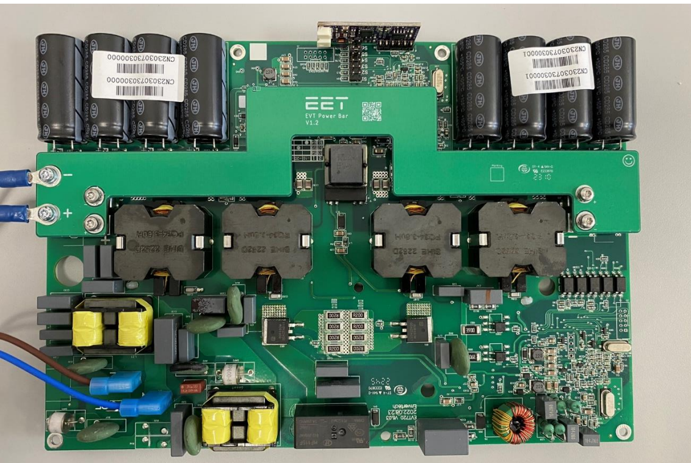
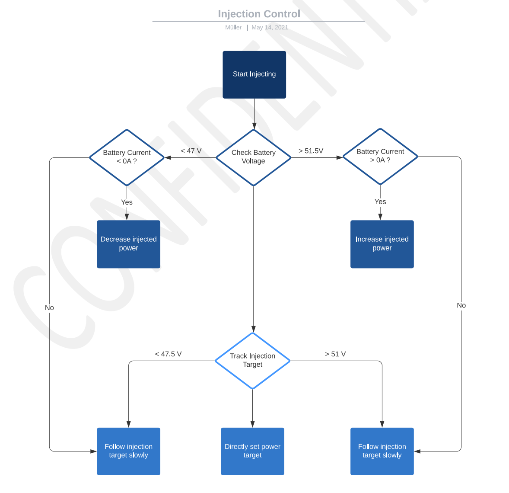

# 6 ONGRID INVERTER

The grid-tie inverter used in the SolMate system is based on an Envertech EVT800 with custom firmware. Its output power can be controlled through a communication interface. A small on-grid interface PCB is used between the PCM and the inverter to handle the protocol and physical-layer translation.

In the current system firmware, the on-grid inverter is supervised by the PCM. The PCM decides when the inverter may be powered, performs pre-charge, enables the inverter through the interface PCB, measures AC power through the HLW8110 energy-meter IC and continuously adjusts the inverter target power.

## 6.1 ELECTRICAL CHARACTERISTICS

| Parameter             | Symbol              | Min | Typ     | Max  | Unit |
| --------------------- | ------------------- | --- | ------- | ---- | ---- |
| Input Voltage         | Vin      | 16  | 48      | 60   | V |
| Output Voltage        | Vout     |     | 220/230 |      | V |
| Input Current         | Iin(cont) | 0  |         | 24   | A |
| Output Current        | Iout     | 0   |         | 3.27 | A |
| Output Power          | Pout     | 0   |         | 800  | W |
| Operating Temperature | Top      | -40 |         | 65   | deg C |
| Efficiency            | eta                 |     |         | 95.6 | % |
| Inverter RS485 Baud Rate |                 |     | 9600    |      | bit/s |
| AC Meter UART Baud Rate |                  |     | 9600    |      | bit/s |
| Compliance            |                     |     |         |      | VDE-AR-N 4105, IEC/EN61000, IEC/EN62109-1/2, EN50549-1/2019, TOR 2019, C10/11:2019, UTE C15-712-1:2013, VFR 2019 |

## 6.2 COMMUNICATION

The on-grid inverter control path uses two different communication channels:

- PCM to on-grid inverter interface: RS485 Modbus RTU at 9600 bit/s.
- PCM to HLW8110 energy meter: UART protocol at 9600 bit/s, even parity.

The CM4 does not communicate with the inverter directly. It reads aggregated on-grid data from the PCM using the PCM UART command `GET_ONGRID_DATA` and sets operating targets through PCM-level commands such as `SET_INJECTION_TARGET` and `SET_COUNTRY_CODE`.

### 6.2.1 Inverter Interface Modbus

The on-grid inverter interface is addressed by the PCM at Modbus address `0x04`. The PCM queues requests and handles responses through the shared RS485 master.

Supported function codes used by the PCM:

| Function Code | Function |
| ------------- | -------- |
| `0x03` | Read holding registers |
| `0x10` | Write multiple registers |

The interface register layout used by the PCM firmware is:

| Byte Offset | Register | Access | Parameter | Unit / Scaling | Description |
| ----------- | -------- | ------ | --------- | -------------- | ----------- |
| `0x00` | Status | R/W | Status flags | bit field | Inverter interface command/state flags |
| `0x02` | Error | R | Error flags | bit field | Inverter interface error flags |
| `0x04` | Temperature | R | Inverter temperature | 0.1 deg C | Temperature reported by the inverter interface |
| `0x06` | Target percent | W | Power command | % | Target output command, written as `1..100` |
| `0x08` | Firmware revision | R | Firmware revision | raw | Interface firmware revision |
| `0x0A` | Country code | W | Grid-code selection | enum | Country/grid-code setting |

The PCM reads status, error and temperature every 5 s. It writes status when enabling or disabling the inverter, target percent whenever the injection controller updates the command, and country code when the CM4 requests a country-code change.

### 6.2.2 Inverter Interface Status Bits

| Bit | Name | Description |
| --- | ---- | ----------- |
| 0 | Power Startup | Inverter power startup has been requested. The PCM is performing the pre-charge and MOSFET startup sequence. |
| 1 | Software Shutdown | Software shutdown has been requested. |
| 2 | Enabled | Inverter interface is enabled. The PCM has completed pre-charge and enabled the main power path. |
| 3 | Grid Sync | Inverter reports grid synchronization. |
| 4 | Country Update | Country-code update success is mirrored into the PCM on-grid status. |

### 6.2.3 Inverter Interface Error Bits

| Bit | Name | Description |
| --- | ---- | ----------- |
| 0 | Communication | Communication between PCM and on-grid inverter interface failed. |
| 1 | Temperature Limit | Inverter temperature limit reached. |
| 2 | Energy Meter | HLW8110 energy-meter initialization or communication failed. |
| 3 | Pre-charge | Inverter pre-charge fault detected. |

Communication failures detach the inverter communication task and raise the on-grid communication error. A pre-charge or temperature-limit error prevents normal inverter startup until the fault is cleared by system restart or service handling.

### 6.2.4 CM4 On-Grid Data

The CM4 reads on-grid data from the PCM with `GET_ONGRID_DATA` (`0x02`). The firmware returns the on-grid data structure without the final firmware-version field:

| Byte Offset | Size | Parameter | Unit / Scaling | Description |
| ----------- | ---- | --------- | -------------- | ----------- |
| 0 | 2 | Status flags | bit field | PCM-side on-grid status |
| 2 | 2 | Error flags | bit field | PCM-side on-grid errors |
| 4 | 4 | Temperature | float deg C | Inverter/interface temperature |
| 8 | 4 | AC voltage | float V | Grid voltage measured by HLW8110 |
| 12 | 4 | AC current | float A | Grid current measured by HLW8110 |
| 16 | 4 | Active power | float W | Active grid power measured by HLW8110 |
| 20 | 4 | Apparent power | float VA | Apparent grid power measured by HLW8110 |
| 24 | 4 | Total energy | float | Accumulated active energy counter |

Firmware versions are returned through the PCM command `GET_FW_VERSIONS`.

## 6.3 FEATURE DESCRIPTION

### 6.3.1 Startup and Shutdown Sequence

The PCM does not switch the inverter on directly from the CAM switch. The CAM switch only requests on-grid injection mode. The PCM enables the on-grid inverter only when all of these conditions are true:

- CAM mode is on-grid.
- Battery-low state is not active.
- Minimum charge limit is not active.
- On-grid temperature-limit error is not active.
- Internal battery heating is not active.
- The internal battery MOSFET is enabled.
- The pre-charge error is not active.

When startup is requested, the PCM enables the pre-charge circuit first. If active power measured by the HLW8110 is already at or above 6 W during pre-charge, the PCM treats this as a pre-charge fault, disables startup and sets the pre-charge error bit.

Normal startup timing:

| Step | Timing | Action |
| ---- | ------ | ------ |
| 1 | 0 s | Enable on-grid pre-charge path. |
| 2 | 8 s | Enable on-grid main power MOSFET. |
| 3 | 9 s | Disable pre-charge path and send inverter enable command over RS485. |

When shutdown is requested, the PCM first commands inverter target power to 0 and clears the power-startup request. The main MOSFET and inverter enable are then disabled after either 30 s or once measured active power has fallen below 6 W.

### 6.3.2 Injection Strategy

The on-grid injection controller tries to follow the CM4 injection target while protecting the battery and respecting thermal and country limits.

The CM4 sets the requested injection power with `SET_INJECTION_TARGET`. The PCM limits this request to:

| Condition | Maximum Injection |
| --------- | ----------------- |
| Default country setting | 800 W |
| Switzerland (`CH`) | 600 W |

The PCM updates the injection command approximately every 700 ms, but only while the inverter is enabled, startup is active and measured AC voltage is above 200 V. At initial synchronization, if measured active power is below 5 W, the PCM commands a minimum target of 5 % to start injection.

The controller uses measured active power from the HLW8110 and adjusts the inverter target percent gradually:

- If measured power is more than 8 W above the target, the target percent is reduced.
- If measured power is more than 8 W below the target, the target percent is increased.
- The adjustment speed scales with the difference between measured and requested power, with a minimum step of 1.
- The final target percent is clamped to `1..100`.

### 6.3.3 Battery Protection During Injection

The injection controller also supervises battery state:

- If the battery is near full, the controller may increase injection to consume excess PV power.
- Near-full detection uses BMS cell-overvoltage, MPPT output voltage above 52.4 V in normal mode, or MPPT output voltage above 51.1 V in smart-charging mode.
- If the internal battery voltage falls below 47.5 V, the controller reduces injection while the battery is discharging.
- If the battery-low or minimum-charge-limit status bits are set, the PCM disables the on-grid inverter.

The PCM also raises the MPPT current limit while on-grid injection is active. The MPPT current limit is 15 A by default and can be raised to 25 A when the on-grid inverter is enabled.

### 6.3.4 Thermal Derating

The PCM receives the inverter/interface temperature from the inverter interface and also uses it for system fan control. On-grid power is derated above 80 deg C. The derating factor decreases from 100 % at 80 deg C to 0 % at 90 deg C. At 90 deg C, the PCM sets the on-grid temperature-limit error and disables further normal operation.

Battery low-temperature discharge derating also affects injection. If internal battery cell temperature is below 0 deg C, the maximum injection command is reduced. At -5 deg C or below, the controller clamps the derating factor to 10 %.

### 6.3.5 AC Energy Metering

The PCM measures the AC side with an HLW8110 energy-meter IC connected to UART3. The firmware configures the meter at startup, reads calibration coefficients, then continuously cycles through these registers:

| HLW8110 Register | Measurement |
| ---------------- | ----------- |
| `0x26` | AC voltage |
| `0x24` | AC current |
| `0x2C` | Active power |
| `0x2E` | Apparent power |
| `0x28` | Active energy |

Measured active power is forced to 0 W when it is between -2 W and +2 W to suppress noise around zero. The total energy counter is accumulated in firmware and stored to EEPROM during shutdown.

If HLW8110 coefficient reads fail during initialization, the PCM sets the on-grid energy-meter error bit.

### 6.3.6 Country Code Handling

The CM4 can request a country-code change with `SET_COUNTRY_CODE`. The PCM stores the requested code in EEPROM and writes the mapped country code to the inverter interface.

Supported country-code enum values in the firmware include:

| Code | Country / Standard |
| ---- | ------------------ |
| `0` | DE |
| `1` | BR |
| `2` | EN50549 |
| `3` | PL |
| `4` | BE |
| `5` | FR |
| `6` | AT |
| `7` | CZ |
| `8` | IT |
| `20` | CH |
| `21` | PT |
| `22` | NL |
| `65535` | Not set |

The firmware maps several higher enum values before writing them to the inverter: `CH` is written as `DE`, `PT` is written as `AT`, and `NL` is written as `EN50549`. Unknown values fall back to `AT`.
