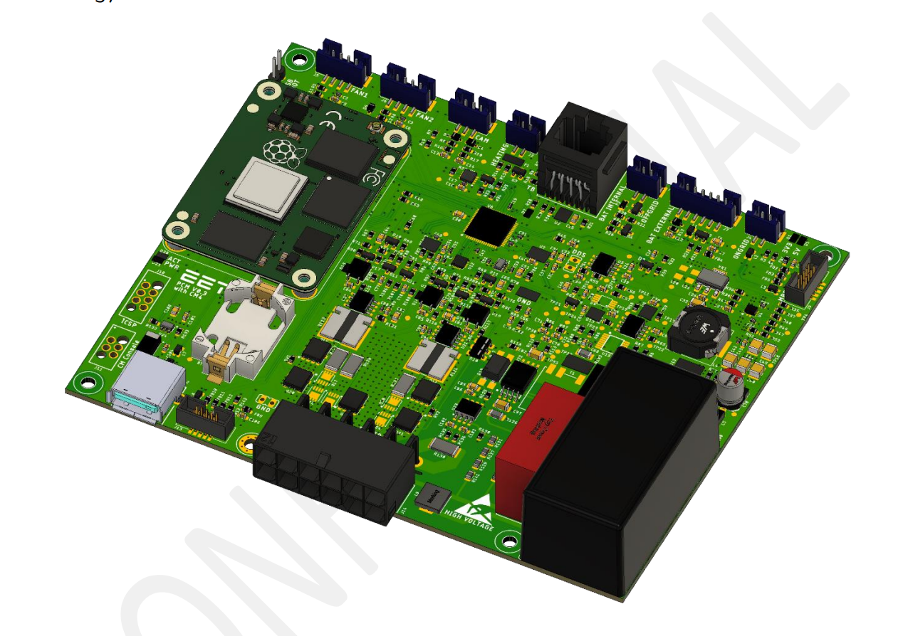

# 4 POWER CONTROL MODULE

The Power Control Module (PCM) is the central control board in the SolMate system and replaces the netD PCB used in previous versions. It coordinates the MPPT, UI, on-grid inverter interface, off-grid inverter switch, battery switching, battery communication and the Raspberry Pi Compute Module 4 (CM4). The netD measurement functionality is also integrated on this PCB.

The firmware treats the PCM as the supervisor of the system. It polls downstream devices over RS485, exposes aggregated data to the CM4 over a separate UART interface, manages the inverter enable states, stores persistent operating data in EEPROM and performs battery-related power management.

## 4.1 ELECTRICAL CHARACTERISTICS

| Parameter                  | Symbol               | Min | Typ | Max  | Unit |
| -------------------------- | -------------------- | --- | --- | ---- | ---- |
| Input Voltage DC           | Vin(DC)   | 5   | 48  | 60   | V |
| Input Voltage AC           | Vin(AC)   | 85  | 230 | 264  | V |
| Battery Current Internal   | IBat(int) | 0   |     | 20   | A |
| Battery Current External   | IBat(ext) | 0   |     | 20   | A |
| Current of Common Terminal | ICom      | 0   |     | 40   | A |
| Ongrid Power Sense         | Pongrid   | 0   |     | 1600 | W |
| Fan Voltage                | VFAN      |     | 5   |      | V |
| Downstream RS485 Baud Rate |                      |     | 9600 |      | bit/s |
| CM4 UART Baud Rate         |                      |     | 115200 |    | bit/s |

## 4.2 COMMUNICATION

The PCM has two firmware-relevant communication interfaces:

- A downstream RS485 Modbus RTU bus. On this bus the PCM is normally the master and communicates with the MPPT, UI, on-grid inverter interface and batteries.
- A CM4 UART interface. This is a separate 115200 bit/s serial link used by the Raspberry Pi Compute Module 4 to read aggregated system data and set operating targets.

### 4.2.1 Downstream RS485 Modbus

The RS485 UART is configured for 9600 bit/s, 8 data bits, no parity and 1 stop bit. The PCM firmware uses Modbus RTU CRC16 on this bus.

| Device / Function          | Address |
| -------------------------- | ------- |
| On-grid inverter interface | `0x04` |
| MPPT                       | `0x05` |
| UI                         | `0x06` |
| PCM slave address          | `0x07` |
| PCM master response address | `0x17` |
| Internal battery BMS       | `38` |
| External battery BMS       | `39` |

Supported downstream function codes include:

| Function Code | Function |
| ------------- | -------- |
| `0x03` | Read holding registers |
| `0x10` | Write multiple registers |
| `0x11` | Fetch/vendor-data response handling |
| `0x12` | Battery set command used for battery wakeup/shutdown |
| `0x92` | Set-command acknowledgement handling |

The firmware retries unanswered RS485 requests up to five times with a 1 s timeout. If a device still does not respond, the corresponding communication error flag is set and the affected task can be detached.

The PCM has a Modbus slave address (`0x07`), but the current firmware does not implement a useful PCM data payload in the slave read/write handlers. Normal system data exchange with the CM4 happens through the UART command interface described below.

### 4.2.2 CM4 UART Protocol

The CM4 interface uses UART2 at 115200 bit/s, 8 data bits, no parity and 1 stop bit. It is a command-oriented binary protocol. The first received byte is a command ID. Responses append a CRC16; for this UART interface the firmware appends the high CRC byte first and the low CRC byte second.

Common read commands:

| Command | Name | Response |
| ------- | ---- | -------- |
| `0x01` | `GET_MPP_DATA` | MPPT data structure, excluding the last 4 bytes |
| `0x02` | `GET_ONGRID_DATA` | On-grid inverter data, excluding firmware version |
| `0x03` | `GET_UI_DATA` | UI error, temperature and indicator subset |
| `0x05` | `GET_PCM_DATA` | PCM status, error, injection mode, fan 1 rpm and fan 2 rpm |
| `0x06` | `GET_BATTERY_INTERNAL_PCM_DATA` | Internal battery PCM data |
| `0x07` | `GET_BATTERY_INTERNAL_BMS_DATA` | Internal battery BMS data |
| `0x08` | `GET_BATTERY_EXTERNAL_PCM_DATA` | External battery PCM data |
| `0x09` | `GET_BATTERY_EXTERNAL_BMS_DATA` | External battery BMS data |
| `0x11` | `GET_VERAKEY` | Stored verakey |
| `0x13` | `GET_COUNTRY_CODE` | Active inverter country code |
| `0x80` | `GET_FW_VERSIONS` | PCM hardware version, UI firmware version, MPPT firmware version and on-grid firmware version |
| `0x81` | `GET_BATTERY_VENDOR_DATA` | Internal battery vendor information |

Common write/test commands:

| Command | Name | Payload |
| ------- | ---- | ------- |
| `0x0A` | `SET_CM_DATA` | CM4 status/error/temperature data |
| `0x0B` | `SET_INJECTION_TARGET` | Target on-grid injection power in W |
| `0x0C` | `SET_MIN_CHARGE` | Minimum allowed internal battery charge threshold in mAh |
| `0x10` | `SET_VERAKEY` | 15 byte verakey |
| `0x12` | `SET_COUNTRY_CODE` | Country code used by the on-grid inverter |
| `0x50` | `SET_FAN_SPEED` | Manual fan command in percent; `-1` returns to automatic mode |
| `0x51` | `SET_INJECTION_MODE` | Test override for CAM mode: `0` on-grid, `1` standby, `2` off-grid |
| `0x52` | `SET_MPP_CURRENT` | Test override for MPPT current limit in mA |
| `0x53` | `SET_MPP_TRACKING` | Test override for MPPT tracking state |
| `0x54` | `SET_MPP_STATE` | Test override for MPPT enabled state |
| `0x55` | `SET_UI_INDICATOR` | Test override for UI indicator code |
| `0x56` | `SET_BATTERY_COULOMB_COUNTER` | Internal battery charge counter in mAh |
| `0x57` | `SET_INJECTED_ENERGY` | On-grid total energy counter |
| `0x58` | `SET_OPERATION_MODE` | `1` requests system shutdown |
| `0x59` | `SET_CONSUMPTION_INJECT_ONLY` | Restricts smart charging behavior for consumption-injection operation |

Write commands acknowledge by returning the command ID, the received byte count and CRC16.

### 4.2.3 PCM Data Layout

`GET_PCM_DATA` returns the first 10 bytes of the PCM data structure:

| Byte Offset | Size | Parameter | Unit / Scaling | Description |
| ----------- | ---- | --------- | -------------- | ----------- |
| 0 | 2 | Status flags | bit field | PCM operating state |
| 2 | 2 | Error flags | bit field | PCM-local errors |
| 4 | 2 | Injection mode | enum | `0` on-grid, `1` standby, `2` off-grid |
| 6 | 2 | Fan 1 speed | rpm | Fan tachometer value |
| 8 | 2 | Fan 2 speed | rpm | Fan tachometer value |

The PCM hardware revision is stored at byte offset 10 in the firmware structure, but is reported through `GET_FW_VERSIONS` instead of `GET_PCM_DATA`.

### 4.2.4 Status Bit Description

| Bit | Name | Description |
| --- | ---- | ----------- |
| 0 | Running | System is in the normal running state. |
| 1 | Shutting Down | Shutdown has been requested. The PCM stores persistent data, shuts down inverters and then disables supplies. |
| 2 | Starting Up | Startup has been requested from the off state. The PCM stores the running state and resets the MCU. |
| 3 | FW Update Ready | Set after persistent data has been saved for firmware update handling. |
| 4 | Battery Pairing | Enables external battery pairing and voltage balancing logic. |
| 5 | Ongrid State | Mirrors/indicates on-grid inverter state. |
| 6 | Offgrid State | Mirrors/indicates off-grid inverter state. |
| 7 | Internal Heating | Reserved for internal battery heating state. |
| 8 | External Heating | Reserved for external battery heating state. |
| 9 | Battery Low | Battery-low state is active; inverter and CM4 operation can be limited. |
| 10 | Min Charge Limit | The configured minimum battery charge has been reached. |
| 11 | Low Temperature Derating | MPPT charge-current derating due to low battery temperature is active. |
| 12 | Consumption Injection Only | Smart-charging/injection behavior is restricted for consumption-injection-only operation. |

### 4.2.5 Error Bit Description

| Bit | Name | Description |
| --- | ---- | ----------- |
| 0 | Communication | Downstream communication error occurred. The specific component also sets its own communication error flag. |
| 1 | Fan 1 | Fan 1 is commanded on but no tachometer speed is measured. |
| 2 | Fan 2 | Fan 2 is commanded on but no tachometer speed is measured. |
| 3 | Current Limit | Internal battery discharge current exceeded the calculated maximum outside off-grid power-limit handling. |
| 4 | ADC | The 16-bit sigma-delta ADC reports an SPI/data error. |
| 5 | I2C EEPROM | EEPROM read failed during startup. |

## 4.3 FEATURE DESCRIPTION

### 4.3.1 Compute Module 4

The main compute unit is the Raspberry Pi Compute Module 4 (CM4). It communicates with the PCM firmware over the dedicated UART2 command interface and can set injection targets, minimum charge thresholds, country code, verakey data and test overrides.

The PCM controls the CM4 5 V rail and shutdown signal. When AC mains is available, the PCM enables the CM4 supply. If the system is running from battery, battery-low state is active, the internal battery voltage falls to 46.5 V or below and no AC mains is detected, the PCM requests CM4 shutdown and then disables the CM4 5 V rail. The CM4 is allowed to boot again when battery-low state is cleared and battery voltage is above 47.5 V.

The USB connector is connected to the CM4 USB controller and is protected by a current-monitoring IC. The PCM PCB must not be powered from an external power supply through the USB port. External USB devices can be supplied from this port if the system is powered normally.

### 4.3.2 Real Time Clock (RTC)

The hardware includes an RTC backed by a CR2032 coin cell so the system can keep time when the CM4 has no network connection. The current PCM firmware reviewed here does not contain RTC management code; RTC use is handled outside the shown PCM firmware logic.

### 4.3.3 EEPROM

The onboard EEPROM stores persistent system data. The firmware reads these values during startup and writes them before shutdown or firmware update handling.

| EEPROM Address | Stored Data |
| -------------- | ----------- |
| `0x00` | PCM operation status |
| `0x02` | Internal battery charge counter |
| `0x06` | External battery charge counter |
| `0x0A` | On-grid total energy counter |
| `0x10` | Country code |
| `0x20` | Verakey |

If EEPROM communication fails during startup, the PCM sets the I2C EEPROM error bit.

### 4.3.4 Fan Control

The PCM controls two system fans with a shared PWM command and measures both fan speeds separately. Fan speed is based on the highest temperature seen by the PCM across:

- MPPT power-stage temperatures,
- on-grid inverter temperature,
- PCM internal battery MOSFET temperature.

Automatic fan control:

| Condition | Fan Command |
| --------- | ----------- |
| Any MPPT or on-grid inverter error active | 100 % |
| Maximum temperature <= 50 deg C | 0 % |
| Maximum temperature 50..70 deg C | Linear ramp from a low duty command to 100 % |
| Maximum temperature >= 70 deg C | 100 % |

The firmware changes the fan PWM only one register step per control cycle to avoid large startup current spikes. Fan malfunction is detected when the fan PWM duty is above the fault-check threshold and one fan reports 0 rpm for approximately 5 s.

### 4.3.5 Battery Pairing

The firmware contains active battery pairing logic for the internal and external battery packs. When battery pairing is enabled and the external battery is detected, the PCM uses the external pre-charge path and temporarily reduces the MPPT current limit to 5 A.

The PCM compares internal and external battery voltages:

- If both voltages are within +/-0.4 V, both battery MOSFETs are enabled.
- If the internal battery voltage is higher by more than 0.4 V, the internal battery is disconnected and the external battery is enabled.
- If the external battery voltage is higher by more than 0.4 V, the external battery is disconnected and the internal battery is enabled.

After both packs are close enough to connect in parallel, the firmware restores the MPPT current limit for the GaN MPPT path.

### 4.3.6 Temperature Sensors

The PCM measures two NTC sensors on the battery MOSFET stages. These temperatures are used for fan control and are reported in the internal/external battery PCM data structures. The UI also has its own temperature/error reporting, and the PCM monitors MPPT and on-grid inverter temperatures through their communication interfaces.

### 4.3.7 Battery Current, Voltage and Charge

The PCM uses a 16-bit sigma-delta ADC to measure internal and external battery voltage and current. Current offset is calibrated at startup. Battery charge is maintained by coulomb counting in mAh and is persisted to EEPROM.

The firmware clamps the charge counter to zero at the lower end and to the battery full capacity reported by the BMS at the upper end. If the charge value read from EEPROM is invalid, it is initialized from battery voltage using a 41 V to 53 V estimate. If the BMS reports an active heating state, the PCM holds the previous charge value instead of integrating current.

Battery communication is only attempted when the measured pack voltage is valid. The firmware polls BMS data every 5 s and requests vendor data once after a valid internal battery is available.

### 4.3.8 CAM Sensing and Injection Mode

The CAM switch selects the requested injection mode. The PCM reads the switch as signal inputs:

| Injection Mode | Value | Meaning |
| -------------- | ----- | ------- |
| On-grid | `0` | Enable and control the on-grid inverter when allowed by battery and temperature state. |
| Standby | `1` | Do not enable on-grid or off-grid inverter output. |
| Off-grid | `2` | Enable the off-grid inverter when allowed by battery and power-limit state. |

The CAM switch does not directly switch inverter power. The firmware decides whether the requested inverter may run based on battery-low state, minimum charge limit, inverter temperature and error flags.

### 4.3.9 On-Grid Inverter Control

The PCM controls the on-grid inverter through a pre-charge path, a power MOSFET and the RS485 inverter interface. On startup, the pre-charge circuit is enabled first. After 8 s, the main MOSFET is enabled; after another 1 s, pre-charge is disabled and the inverter is enabled through RS485. If active power is already above 6 W during pre-charge, a pre-charge fault is set.

The on-grid inverter is enabled only when:

- CAM mode is on-grid,
- battery-low state is not active,
- minimum charge limit is not active,
- inverter temperature-limit error is not active,
- internal battery heating is not active.

When the inverter is synchronized and AC voltage is above 200 V, the PCM updates the injection target approximately every 700 ms. The target is limited to 800 W by default and 600 W for Switzerland (`CH`). Above 80 deg C inverter temperature, the injection command is derated; at 90 deg C, the on-grid temperature-limit error is set.

### 4.3.10 Off-Grid Inverter Switch

The off-grid inverter is switched by the PCM through its enable line. The firmware enables it only when CAM mode is off-grid, battery-low state is not active, minimum charge limit is not active and the off-grid power-limit error is not active.

If the internal battery current exceeds the calculated maximum while off-grid is enabled, the firmware disables the off-grid inverter and sets the off-grid power-limit warning. This warning is cleared when the CAM switch leaves off-grid mode.

### 4.3.11 Power Supply

The PCM has redundant supply paths. It can be powered from the AC/DC supply or from the battery/MPPT DC path through the 5 V buck converter. The firmware uses the measured on-grid AC voltage as the AC-power-good condition. When AC is available, the CM4 supply is kept enabled. When AC is unavailable and the battery reaches the low-voltage shutdown threshold, the PCM performs the CM4 shutdown sequence and then disables low-priority loads.

### 4.3.12 Power Management

Power management is handled by several coordinated firmware mechanisms.

**MPPT charge-current management**

The PCM sets the MPPT current limit to 15 A by default. When the on-grid inverter is enabled, it can raise the MPPT current limit to 25 A. Smart charging is enabled when the internal battery charge is within 2 Ah of full capacity or the BMS reports cell overvoltage. Smart charging is disabled again when charge falls more than 4 Ah below full capacity and no cell-overvoltage warning is present.

Battery low-temperature charge derating is applied from 5 deg C downward. Between 5 deg C and 0 deg C, the MPPT current limit is mapped from 5 A down to 1 A. Below 0 deg C, it is limited to 0.5 A.

**Battery-low state**

When battery communication is valid, battery-low state is entered if the BMS reports cell low voltage or if pack voltage remains below the low-battery threshold long enough. The base threshold is 47.2 V. In off-grid mode, the threshold is reduced with discharge current, by up to 1.5 V at 25 A discharge. Battery-low state is cleared when the internal charge counter rises above 1000 mAh and the BMS cell-low-voltage warning is not active.

If battery communication is not valid, the fallback voltage-only logic enters battery-low state below 46 V and clears it above 49 V.

**Minimum charge limit**

The CM4 can set a minimum charge threshold. If the internal battery charge counter is below that threshold and the system is not in off-grid mode, the PCM sets the minimum-charge-limit status bit and disables inverter operation. The limit is released when charge rises at least 1000 mAh above the configured threshold.

**Full battery handling**

The internal charge counter is set to full capacity when the firmware sees sustained full-battery evidence: internal battery voltage above 53 V, BMS cell overvoltage, MPPT battery-full status, or MPPT output voltage above the smart-charge threshold while smart charging is active.

**Shutdown handling**

A shutdown request causes the PCM to store battery charge counters, on-grid total energy and operation status to EEPROM, request CM4 shutdown, disable inverters, stop the fan, put auxiliary functions to sleep, disable battery MOSFETs and then wait for a later startup request.
