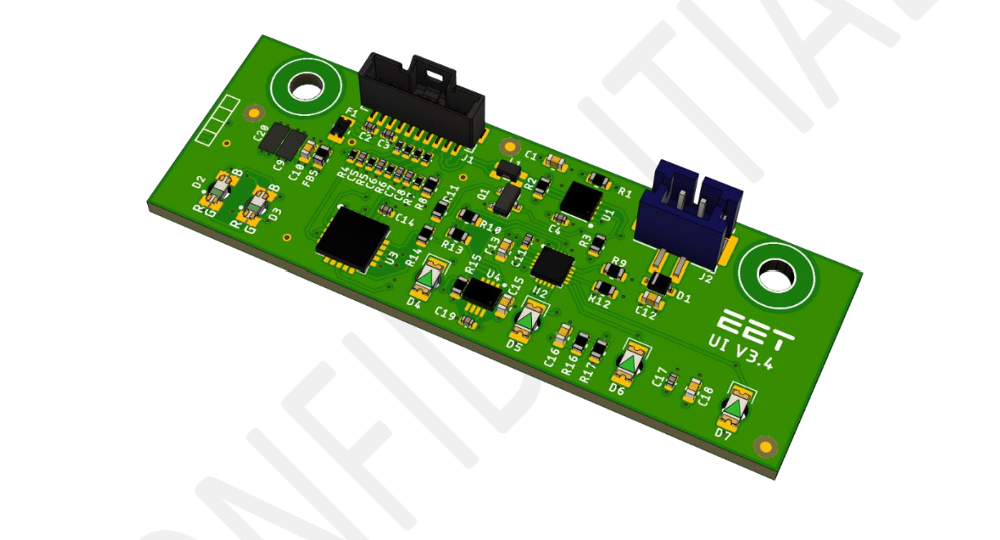

# 3 USER INTERFACE 

The User Interface provides visual feedback and information for the user. Since the SolMate V2.0, the UI is also responsible for power on/off the system since there is no more switch at the back of the system. 

The UI is now powered by an MCU from Microchip which enables independent operation allowing an improved user experience like faster response times and better LED animations. Additionally, this also allows the UI to operate even when the Raspberry is not working.

The UI is now also able to display error and warning codes which should help the user to identify problems in case of a malfunction. 

## 3.1 ELECTRICAL CHARACTERISTICS

| Parameter                | Symbol            | Min | Typ | Max  | Unit |
| ------------------------ | ----------------- | --- | --- | ---- | ---- |
| Input Voltage            | Vin    |     | 3.3 |      | V    |
| Sensor Temperature Range | Tsense | -55 |     | +125 | °C   |

## 3.2 COMMUNICATION 

For the physical layer RS485 is used. On top of this Layer Modbus RTU is implemented which is a protocol which has been standardized for industrial applications.

Communication speed is 9600 kbit/s, the default address of the MPPT is 0x06.
The following parameters can be written/read using this communication. 

| Parameter   | Unit | Description         |
| ----------- | ---- | ------------------- |
| Error       |      | Indicates errors    |
| Temperature | °C   | Ambient temperature |

The Status and Error fields are containing bits which give more information about the system. 

### 3.2.1 Status

Please refer to PCM Status flags 

### 3.2.2 Error Byte 

| Bit | Short Description  | Description                                             |
| :-- | :----------------- | ------------------------------------------------------- |
| 0   | Communication      | A communication error occurred                          |
| 1   | Temperature Sensor | I2C communication with LM75 was not possible            |
| 2   | LED Driver         | I2C communication with ISSI LED driver was not possible |

## 3.3 FEATURE DESCRIPTION 
### 3.3.1 Systemof/off 

The SolMate will be power on/off using the UI button.

To turn the system on or off, press the UI button for 7 seconds. After 2 seconds, the start/stop animations start to play. In this animation, the RGB lights up in the EET theme color and the indicator LEDs light up on by one until all LEDs are on. At this point a continuous animation starts to play which is ongoing until the system has started or stopped.

When the button is released before the continuous animation starts, the animation will fade out and the system will stay in its current operating state. 

When the system is powered down, the UI doesn’t react to button presses (except for the long press) which gives the user the illusion that the system is completely turned off. However, all the PCBs are still supplied but communication is inactive. 

### 3.3.2 Hard Reset

When the system completely frozen or hang up, there is the possibility of performing a hard reset which power cycles all components in the SolMate. This reset should only be used when performing a restart is not possible or not working. 
To perform a hard reset, all cables must be disconnected from the SolMate and the UI button must be pressed for 15 seconds. 
Please Note: Performing a hard reset can lead to data loss on the Raspberry! Only use if absolutely necessary. 

### 3.3.3 Temperature Sensor

Like in the previous UI versions, the UI still has an onboard temperature sensor. This temperature can be used to observer the air temperature inside the case. 

### 3.3.4 Power Supply

The UI is supplied externally by the PCM and has no onboard voltage regulator. 

### 3.3.5 Error Indication

When the PCM detects a malfunction, an error or warning code will be sent to the UI which displays this code in binary format using the 4 indicator LEDs. Therefore 16 different errors or warning can be displayed which are differentiated by the colour of the RGB led. Yellow indicates that a warning has occurred while red means an error has occurred. 

The following error codes can be currently displayed on the UI: 

| Code | Short Description               | Description                                                                      |
| ---- | ------------------------------- | -------------------------------------------------------------------------------- |
| 1    | Overcurrent                     | The battery current was too high and the system shut down                        |
| 2    | MPPT Temperature Limit          | The MPPT has reached its temperature limit and shut down                         |
| 3    | Communication UI                | The communication via RS485 with the UI is not possible                          |
| 4    | Communication MPPT              | The communication via RS485 with the MPPT is not possible                        |
| 5    | Communication Battery           | The communication via RS485 with the Battery is not possible                     |
| 6    | Communication Ongrid Inverter   | The communication via RS485 with the Ongrid Inverter is not possible             |
| 7    | ADC Fault                       | The ADC on the PCM has a malfunction                                             |
| 8    | Ongrid Overtemperature          | he ongrid inverter has exceeded its maximum allows temperature and was shut down |
| 9    | MPPT Input Overvoltage          | he maximum allows input voltage of the MPPT has been exceeded                    |
| 10   | MPPT Reverse Polarity           | he input voltage is in reverse polarity                                          |
| 11   | Ongrid Premature Injection      | Ongrid is not configured correctly and injection starts too soon                 |
| 12   | ERROR_BAT_PRE_CHARGE            |                                                                                  |
| 13   | ERROR_COMMUNICATION_UI_EXT      |                                                                                  |
| 14   | ERROR_MPPT_INPUT_OVERCURRENT_PF |                                                                                  |

The following warning codes can be currently displayed on the UI: 

| Code | Short Description         | Description                                                                    |
| ---- | ------------------------- | ------------------------------------------------------------------------------ |
| 1    | FAN Fault                 | One or more of the two FANs on the PCM are not working                         |
| 2    | Missing Network Interface | The Raspberry Pi could not find a network Interface                            |
| 3    | Offgrid Power             | The maximum allowed battery current has been exceeded by the Offgrid inverter  |

