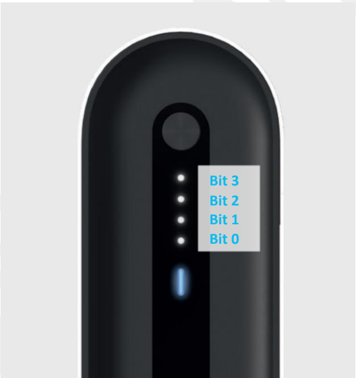

# 3 USER INTERFACE

The user interface provides the local button and LED feedback for the SolMate system. Since SolMate V2.0 the system no longer has a separate rear power switch, so the UI button is also part of the start, shutdown and hard-reset handling.

The UI board has its own Microchip PIC24FJ MCU. The UI firmware controls the front-panel button, RGB LED, four indicator LEDs, the IS31 LED driver, the LM75B temperature sensor and the RS485 Modbus interface. This allows the UI to react even when the Raspberry Pi is not running.

The PCM is the Modbus master for normal operation. It reads UI status/temperature data and writes the current PCM operating state, user-facing gauge values and error/warning indication codes.

## 3.1 ELECTRICAL CHARACTERISTICS

| Parameter | Symbol | Min | Typ | Max | Unit / Notes |
| --------- | ------ | --- | --- | --- | ------------ |
| UI supply voltage | Vin | | 3.3 | | V, supplied by PCM |
| Temperature sensor range | Tsense | -55 | | 125 | deg C, LM75B sensor range |
| RS485 baud rate | | | 9600 | | bit/s |
| RS485 format | | | 8N1 | | 8 data bits, no parity, 1 stop bit |
| UI Modbus address | | | 0x06 | | PCM uses this as the UI slave address |
| UI hardware revision value | | | 350 | | returned when the hardware ID ADC input maps to UI HW rev. 3.50 |

The UI has no local voltage regulator in the firmware-supported design; the PCM supplies the UI electronics directly.

## 3.2 HARDWARE FUNCTIONS

The UI MCU supervises:

- the front-panel button,
- one RGB LED,
- four white indicator LEDs,
- the LED driver enable line,
- the LM75B temperature sensor on I2C,
- RS485 communication to the PCM.

The LED driver is disabled when the LEDs have been inactive for more than 30 s. It is re-enabled automatically when an animation, gauge or indicator code needs to be shown.

## 3.3 COMMUNICATION

The UI communicates over RS485 using Modbus RTU framing. The PCM acts as master and the UI acts as slave at address `0x06`.

| Parameter | Value |
| --------- | ----- |
| Physical layer | RS485 |
| Protocol | Modbus RTU style framing |
| Baud rate | 9600 bit/s |
| Parity | none |
| Data bits | 8 |
| Stop bits | 1 |
| CRC | Modbus CRC16, transmitted LSB first then MSB |
| UI slave address | `0x06` |

The UI firmware supports the following function codes:

| Function Code | Direction | Description |
| ------------- | --------- | ----------- |
| `0x03` | PCM reads from UI | Read UI data registers. |
| `0x10` | PCM writes to UI | Write PCM status, indicator code or gauge data. |

The firmware register addresses below are byte offsets into the UI data structure. Register counts in the Modbus request are 16-bit word counts, so a count of `1` transfers 2 bytes and a count of `3` transfers 6 bytes. Multi-byte values are transferred in the firmware byte layout used by the PIC firmware; the temperature field is the 32-bit C `float` stored by the UI firmware.

### 3.3.1 UI Register Map

| Offset | Field | Size | Direction | Description |
| ------ | ----- | ---- | --------- | ----------- |
| `0x00` | PCM/UI status flags | 2 bytes | bidirectional | PCM operating state mirrored into the UI; UI sets start/shutdown request bits. |
| `0x02` | UI error flags | 2 bytes | UI writes, PCM reads | Local UI faults. |
| `0x04` | UI temperature | 4 bytes | UI writes, PCM reads | LM75B temperature in deg C. |
| `0x08` | Indicator code | 2 bytes | PCM writes | Error, warning or manual test code to display. |
| `0x0A` | Battery capacity | 2 bytes | PCM writes | Battery gauge value in percent. |
| `0x0C` | Produced power | 2 bytes | PCM writes | PV production gauge value in percent. |
| `0x0E` | Injected power | 2 bytes | PCM writes | Grid/off-grid output gauge value in percent. |
| `0x10` | UI revision value | 2 bytes | UI writes, PCM reads | Currently populated from the UI hardware-revision ADC measurement. |

The PCM performs these regular UI transactions:

| PCM Action | Timing | Modbus Operation |
| ---------- | ------ | ---------------- |
| Read UI status, UI error and temperature | every 10 s | read 4 words starting at `0x00` |
| Write battery, produced and injected gauge values | every 5 s | write 3 words starting at `0x0A` |
| Write operating state | on state change | write 1 word at `0x00` |
| Write indicator code | on code change | write 1 word at `0x08` |
| Read UI revision value | once during PCM startup | read 1 word at `0x10` |

### 3.3.2 Status Flags

The PCM writes its operating status into the UI status field. The UI firmware currently uses the `running`, `shutting_down` and `starting_up` bits for start/stop behavior and LED animation handling.

| Bit | PCM Name | UI Firmware Name | UI Use |
| --- | -------- | ---------------- | ------ |
| 0 | Running | Running | Enables normal UI indication. |
| 1 | Shutting down | Shutting down | UI waits for shutdown completion. |
| 2 | Starting up | Starting up | UI waits for startup completion. |
| 3 | Firmware update ready | Online | Not used by current UI behavior. |
| 4 | Battery pairing | Battery pairing | Not used by current UI behavior. |
| 5 | On-grid state | On-grid state | Not used by current UI behavior. |
| 6 | Off-grid state | Off-grid state | Not used by current UI behavior. |
| 7 | Internal heating | Internal heating | Not used by current UI behavior. |
| 8 | External heating | External heating | Not used by current UI behavior. |
| 9 | Battery low | not named in UI firmware | Ignored by current UI firmware. |
| 10 | Minimum-charge limit | not named in UI firmware | Ignored by current UI firmware. |
| 11 | Low-temperature derating active | not named in UI firmware | Ignored by current UI firmware. |
| 12 | Consumption-injection only | not named in UI firmware | Ignored by current UI firmware. |

### 3.3.3 UI Error Flags

| Bit | Name | Description |
| --- | ---- | ----------- |
| 0 | Communication | Set by the UI when the PCM pulls the shared UI button/communication fault line low. |
| 1 | Temperature sensor | I2C access to the LM75B temperature sensor failed. |
| 2 | LED driver | I2C access to the IS31 LED driver failed. |

If the PCM detects a Modbus communication error with the UI, it sets the UI communication error on the PCM side, detaches the regular `ui_handler`, and pulses the shared UI line so the UI firmware can show code 13 locally.

## 3.4 USER OPERATION

### 3.4.1 System Start and Shutdown

The UI button is an open-drain/shared signal between the UI MCU and PCM. The UI firmware detects the button press and controls the visual start/stop animation. The PCM firmware also monitors the same line for long-press shutdown handling.

Normal start/stop sequence:

| Button Timing | UI Behavior |
| ------------- | ----------- |
| Press shorter than 2 s | In running mode, advances to the next gauge view. |
| Press longer than 2 s | Starts the boot/shutdown animation. |
| Release before the 7 s action point | Cancels the animation and leaves the system state unchanged. |
| Hold until 7 s | Sets `starting_up` when the system is off, or `shutting_down` when the system is running. |

During startup or shutdown, the RGB LED uses the EET theme color and the four indicator LEDs run the boot/progress animation. The UI then waits until the PCM writes an updated operating state back to the UI.

When the system is not running, the UI does not show normal gauge views. The UI still monitors the long button press so the system can be started again.

### 3.4.2 Hard Reset / Power Shutdown

The PCM firmware monitors the UI button line independently. If the line has been held active for at least 15 s and is then released, the PCM enables the hardware power-shutdown signal.

Use this only as a recovery path when the normal shutdown path is not available. A hard reset can interrupt the Raspberry Pi and may cause data loss.

### 3.4.3 Gauge Views

When the system is running and no indicator code is active, each short button press advances through the local gauge views:

| View | RGB Color in Firmware | Gauge Source |
| ---- | --------------------- | ------------ |
| Battery capacity | Blue | `bat_capacity`, calculated by PCM from internal battery charge and full capacity. |
| Produced power | Yellow | `produced_pwr`, calculated by PCM from PV voltage/current. |
| Injected/output power | Green | `injected_pwr`, calculated by PCM from on-grid active power or off-grid battery/output power. |
| Idle | LEDs off | No gauge displayed. |

The four indicator LEDs form a coarse 0..100 % bar graph. Each LED represents roughly one quarter of the value. A gauge view times out after 20 s without a further button press.

### 3.4.4 Temperature Sensor

The UI board includes an LM75B temperature sensor. The UI firmware reads it once per second and stores the temperature in the UI data structure. The value is intended as an internal case/ambient temperature measurement.

## 3.5 INDICATOR CODES

The PCM writes a single indicator code to register offset `0x08`. The UI firmware decodes it as follows:

| Encoded Range | RGB Color | Meaning |
| ------------- | --------- | ------- |
| `0` | LEDs off | No indicator. |
| `1..63` | Red | Critical error code. |
| `64..127` | White | Manual/test indicator code, displayed as `encoded - 64`. |
| `128..255` | Orange | Warning code, displayed as `encoded - 128`. |

The four indicator LEDs show the decoded code in binary format, with LED 0 representing bit 0.

### 3.5.1 Error Codes

| Code | Firmware Symbol | Short Description | Condition |
| ---- | --------------- | ----------------- | --------- |
| 1 | `ERROR_OVERCURRENT` | Overcurrent | Battery current exceeded the configured maximum current. The PCM performs a critical fault shutdown. |
| 2 | `ERROR_MPP_TEMP_LIMIT` | MPPT temperature limit | The MPPT reports its temperature-limit error. |
| 3 | `ERROR_COMMUNICATION_UI` | UI communication | PCM communication with the UI failed. |
| 4 | `ERROR_COMMUNICATION_MPP` | MPPT communication | PCM communication with the MPPT failed. |
| 5 | `ERROR_COMMUNICATION_BATTERY` | Battery communication | PCM communication with the battery/BMS failed. |
| 6 | `ERROR_COMMUNICATION_ONGRID` | On-grid inverter communication | PCM communication with the on-grid inverter failed. |
| 7 | `ERROR_ADC` | PCM ADC fault | The PCM ADC reports a fault. |
| 8 | `ERROR_EVT_OVERTEMP` | On-grid inverter overtemperature | The on-grid inverter reports its temperature-limit error. |
| 9 | `ERROR_MPP_INPUT_OVERVOLTAGE` | MPPT input overvoltage | MPPT input voltage exceeded the allowed range. |
| 10 | `ERROR_MPP_REVERSE_POLARITY` | MPPT reverse polarity | MPPT input reverse-polarity fault. |
| 11 | `ERROR_INV_PRE_CHARGE` | Inverter pre-charge | On-grid inverter pre-charge failed. |
| 12 | `ERROR_BAT_PRE_CHARGE` | Battery pre-charge | Internal battery pre-charge check failed. |
| 13 | `ERROR_COMMUNICATION_UI_EXT` | External UI communication signal | UI-side communication fault indication through the shared line. |
| 14 | `ERROR_MPPT_INPUT_OVERCURRENT_PF` | MPPT permanent input overcurrent | MPPT reports a permanent overcurrent fault. |

Critical errors are set by the PCM when the corresponding subsystem fault is active. Some communication faults also detach the affected communication handler until the next restart or recovery path.

### 3.5.2 Warning Codes

Warnings are encoded as `128 + code` before being written to the UI.

| Code | Encoded Value | Firmware Symbol | Short Description | Condition |
| ---- | ------------- | --------------- | ----------------- | --------- |
| 1 | 129 | `WARNING_FAN` | Fan fault | Fan PWM is active but fan 1 or fan 2 reports zero RPM long enough to trip the warning. |
| 2 | 130 | `WARNING_MISSING_INTERFACE` | Missing network interface | Raspberry Pi reports that no network interface is available. |
| 3 | 131 | `WANRING_OFFGRID_PWR_LIMIT` | Off-grid power limit | Off-grid inverter drew too much battery current; PCM disables off-grid output. The symbol name is spelled this way in the current PCM firmware. |

Warnings are cleared when the underlying condition clears. If an indicator code is active, the UI displays the code instead of the gauge views.

### 3.5.3 Local UI Faults

The UI firmware also detects local I2C faults:

| Local Fault | UI Error Bit | Effect |
| ----------- | ------------ | ------ |
| LM75B temperature sensor NACK | Temperature sensor | Set in the UI error field read by the PCM. |
| IS31 LED driver NACK | LED driver | Set in the UI error field read by the PCM. |

These local UI errors are reported through the UI error register. The PCM can decide separately whether and how to expose them as a user-facing indicator code.
